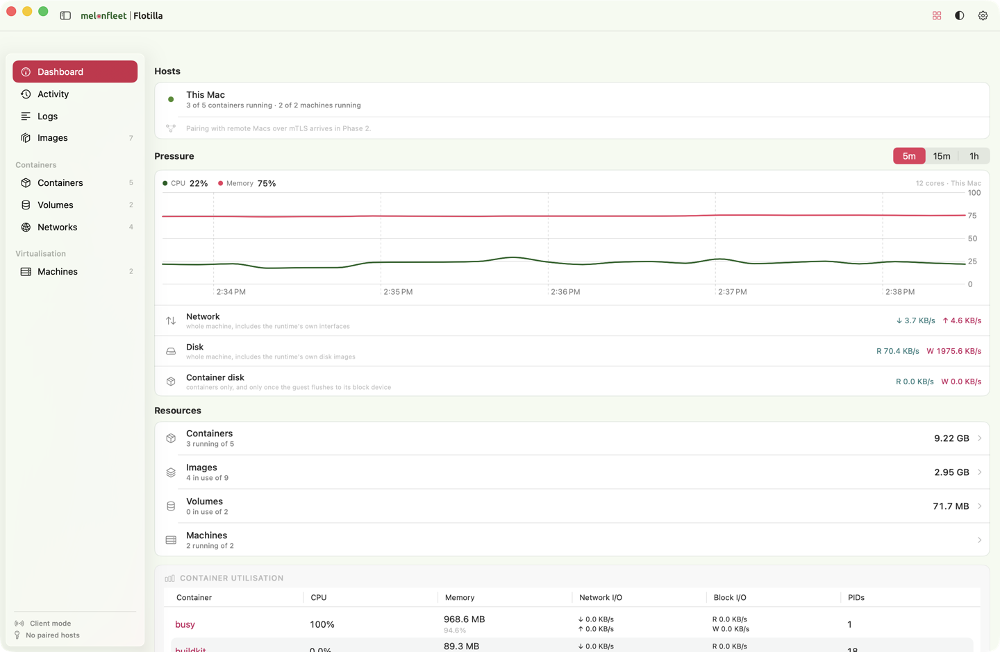
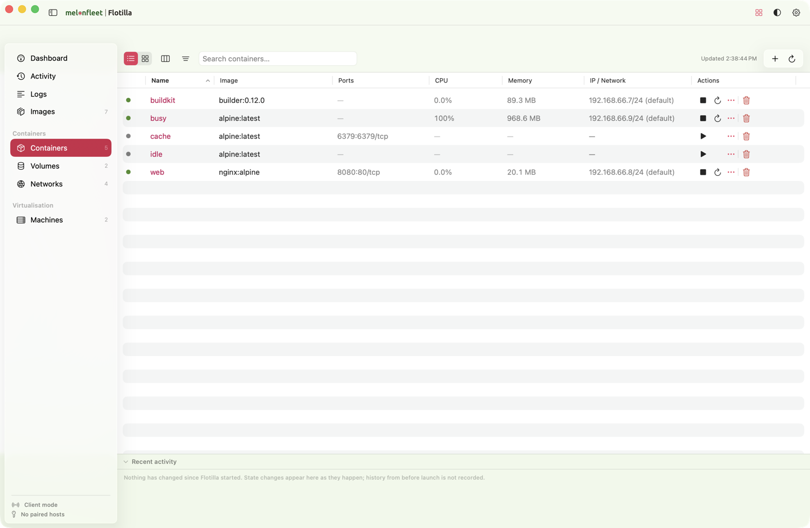
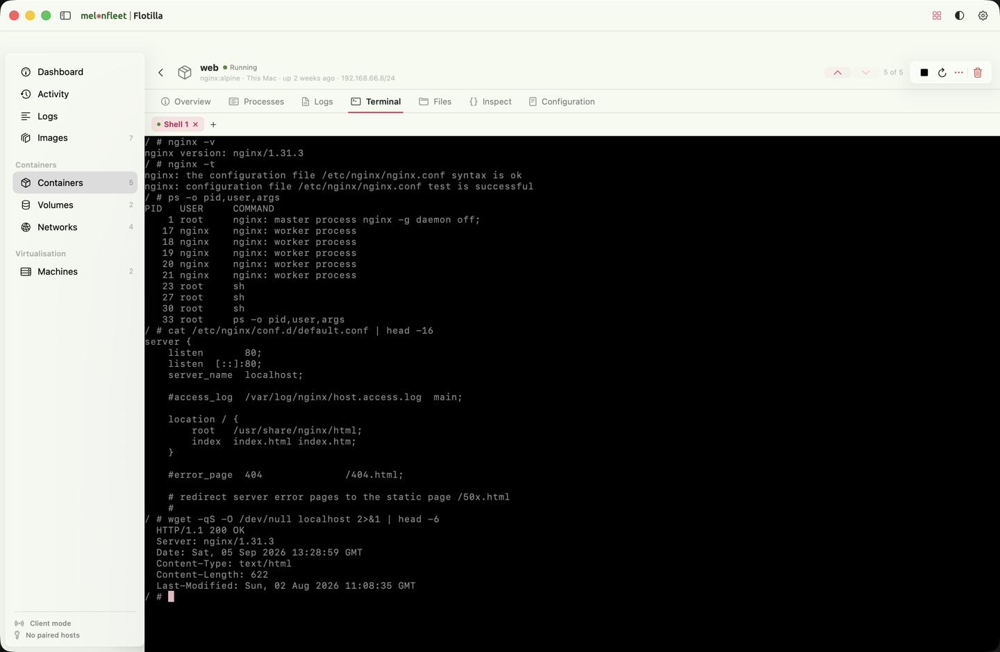
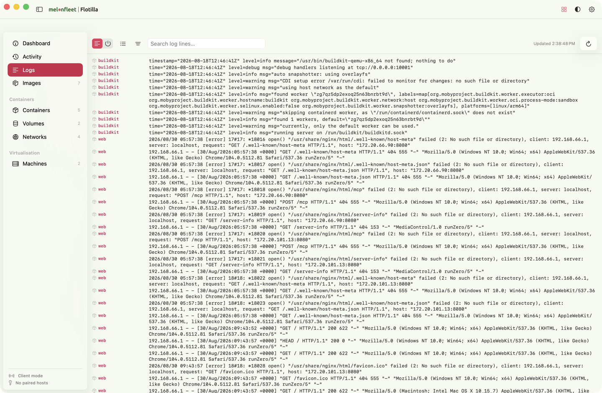
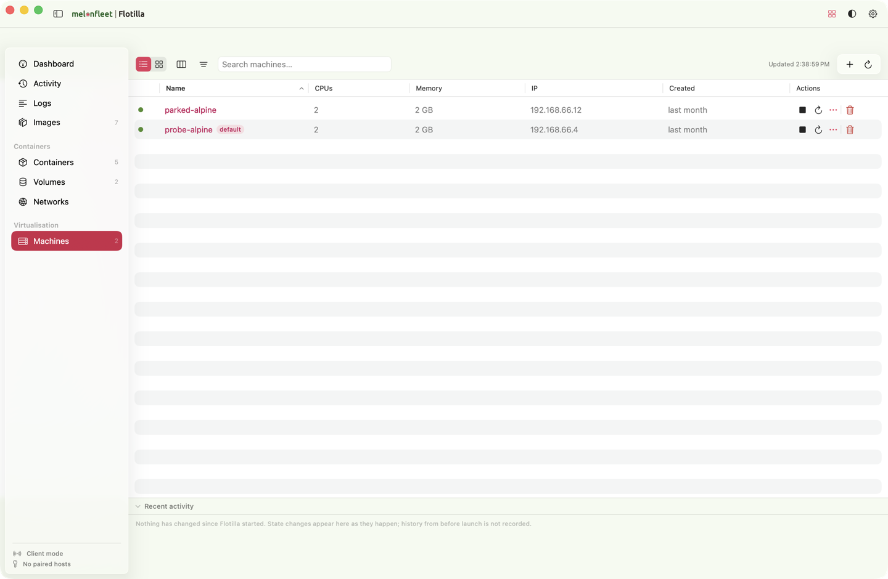

<p align="center">
  
</p>

<h1 align="center">Flotilla</h1>

<p align="center"><strong>Apple's containers, with a window.</strong></p>

<p align="center">
  Apple shipped <code>container</code> for macOS and left it on the command line.<br>
  Flotilla is the native app on top: containers, images, volumes, networks and the<br>
  virtual machines they run inside — plus a real terminal in every container.
</p>

<p align="center">
  <a href="https://github.com/melonfleet/flotilla/actions/workflows/ci.yml"></a>
  
  
  
  
  
</p>

<p align="center">
  
</p>

---

## What it is

A **native SwiftUI app** that drives Apple's own `container` CLI. It does not link the
Containerization framework and it does not reimplement the runtime — it builds a command,
validates it against a default-deny allowlist, runs it, and decodes the JSON. Flotilla shows you
the exact command it used, so nothing happens that you could not have typed yourself.

Free. No account, no sign-in, no telemetry, no subscription, no paid tier.

## Requirements

| | |
|---|---|
| **macOS 26 or later** | On Apple silicon. Apple's container runtime needs both, so Flotilla does too. |
| **Apple's `container` CLI** | Installed separately from [apple/container](https://github.com/apple/container). Flotilla drives that tool; it does not bundle or replace it, and it will offer to start the runtime service if it is not running. |
| **Nothing else** | No account, no telemetry, no background phone-home. The app fetches nothing at launch — even the wordmark is drawn in SwiftUI rather than loaded as a webfont. |

## Getting it

**There is no release yet.** Packaged distribution is coming as a signed, notarised
`.pkg`; this repository will not ship `.zip` builds. Until then, build it yourself:

```sh
git clone https://github.com/melonfleet/flotilla.git
cd flotilla
Scripts/make-app.sh          # assembles build/Flotilla.app
open build/Flotilla.app
```

`Scripts/make-app.sh` signs ad-hoc, which is fine locally. Note that macOS may refuse
login-item registration for an ad-hoc-signed bundle — that is expected, not a bug.
`RELEASING.md` documents the signed-and-notarised path.

## What it looks like

| | |
|---|---|
|  | **Containers.** Live CPU and memory per container, published ports, addresses, and start/stop/delete on the row. Switch to cards if you prefer. |
|  | **Terminal.** A real shell inside any running container or machine — test a config, read the process table, ask it for a page, without leaving the window. |
|  | **Logs.** Every source in one feed, each line tagged with where it came from, filterable by name or text. No tab-hopping between containers. |
|  | **Machines.** The virtual machines your containers actually run inside — create, resize, start, stop, and open a shell in one. |

## How it works

```text
SwiftUI app  ──▶  ContainerCLI  ──▶  Allowlist  ──▶  ContainerHost  ──▶  container(1)
                                         │
                        MountPolicy · ExecPolicy · WirePolicy
```

`ContainerHost` is the execution spine. UI code never constructs a raw command and never cares
whether a host is local or remote. Every execution crosses the **`Allowlist`** — a default-deny
table of 47 command specs with typed argument shapes — and the capability policies that apply.

Three policies are injected per executor rather than hardcoded, so the same core can be built
strictly or permissively depending on who is asking:

- **`MountPolicy`** — which host paths may be bind-mounted. Default is deny.
- **`ExecPolicy`** — whether an interactive shell grammar is reachable at all. `exec <id> sh` is
  refused by default; the terminal works because the app builds a CLI carrying
  `.interactiveShell` for the machine's own owner.
- **`WirePolicy`** — which subcommands a remote peer may reach, for commands that no argument
  shape can refuse.

Two supporting rules the project holds to, both learned the hard way and documented at the code:

- **Fixtures are captured from the real CLI, never written.** A hand-written `Tests/.../Fixtures/volumes.json` once
  matched the models instead of reality, so the decoder threw the moment a real volume existed —
  with a green test suite throughout.
- **A control either works or is visibly disabled with the reason stated.** An independent audit
  found 11 of 26 settings read by nothing; `Scripts/check-settings-consumers.sh` now fails the
  build if a setting marked available has no consumer.

## Status

Working Swift code, not a starter kit. **335 tests pass** — run `swift test` for the current
number rather than trusting this one.

**Built:** containers, images, volumes, networks and machines with full lifecycle; an aggregated
log feed; a live host dashboard; embedded container and machine shells; a validated live command
preview in the run sheet; a typed settings registry with managed `defaults`/`locked` precedence;
diagnostics snapshots with redaction and a support bundle.

**Not built** — stated here because a settings screen is a poor place to discover it:

- **Remote access (Phase 2).** No wire transport, no mTLS runtime, no listener, no Bonjour. The
  related settings are marked not-yet-available, their controls are disabled, and they are
  withheld from the MDM payload so an administrator cannot push a key the app ignores.
- **Updates.** There is no updater; the four Sparkle settings are disabled for the same reason.
- **Streaming.** `logs --follow` and live `stats` need an async streaming API. Today every read
  is one bounded invocation.
- **App-layer tests.** The only test target covers `FlotillaCore`, which is why decisions that
  matter are pushed down into it — `DeletePolicy` lives in the core, not in the views.

## Development

**macOS** — Apple silicon, macOS 26, Swift 6.2 or newer. The unit tests use captured fixtures
and do not need `container` installed.

```sh
swift build
swift test
swift run Flotilla
swift run flotilla-probe     # exercises the live container JSON surface
```

**Linux** — Swift 6.1. SwiftPM selects `Package@swift-6.1.swift`, which exposes only the
Foundation-only core, the probe and the tests. `FlotillaCore` is kept free of SwiftUI, AppKit,
Network.framework and Security precisely so that core and data work stays independently
verifiable off a Mac.

```sh
swift build
swift test
```

**Invariant checks** — a few things the compiler cannot check are enforced by script, and each
one exists because it already went wrong once:

| Script | What it refuses to let through |
|---|---|
| `Scripts/check-settings-consumers.sh` | a setting marked available with no code reading it |
| `Scripts/check-defaults.sh` | a screenshot scaffold or wrong `@State` default reaching a build |
| `Scripts/check-test-isolation.sh` | a test that passes only because another test ran first |
| `Scripts/check-hygiene.sh` | real identity, credentials or key files in tracked files |
| `Scripts/check-history.sh` | the same, anywhere in the git history — run before publishing |

## Documentation

The [**Wiki**](https://github.com/melonfleet/flotilla/wiki) is the place to start for using the
app. In the repository:

| File | What it holds |
|---|---|
| `DECISIONS.md` | settled product and security choices, with the rejected alternatives |
| `RELEASING.md` | signing, notarisation and stapling, end to end |
| `CLAUDE.md` | project orientation, architecture, and hard-won lessons |
| `research/` | the background studies the scope was derived from |
| `reference/cli-help/` | captured `--help` for every `container` subcommand — 51 files, the allowlist's source of truth |

## Licence

Personal, non-commercial project. **No licence is granted at this time** — see
[`LICENSE`](LICENSE). The code is here to be read; if you want to use it, ask.

---

<p align="center">
  <a href="https://melonfleet.dev">melonfleet.dev</a> ·
  <a href="https://github.com/apple/container">apple/container</a> ·
  no cookies, no analytics
</p>
