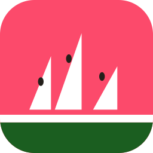

<p align="center">
  
</p>

<h1 align="center">Flotilla</h1>

<p align="center">
  A native macOS app for managing Apple's <code>container</code> containers on the
  local machine <strong>and</strong> across a fleet of remote Macs.
</p>

Flotilla is a personal, non-commercial fleet console for Apple Silicon Macs. It
wraps the `container` CLI instead of linking the Containerization framework, and
uses one shared core for local and eventual remote hosts. The product is
table-first: the primary view is a cross-host container table, with a shallow
menu-bar surface for status and quick access.

Remote communication is designed around Network.framework, mTLS, Bonjour
discovery, and manual host entry for routed networks. It is not an SSH wrapper,
generic remote shell, or Kubernetes-style orchestrator.

## Current status

The repository contains working Swift code, not a starter kit.

- `FlotillaCore` is a substantial, Foundation-only library: the
  `ContainerHost`/`LocalHost` execution spine (concurrent pipe drain, per-stream
  byte ceilings, enforced per-command deadlines), real `container` JSON models,
  the 47-spec `Allowlist` with `MountPolicy`, `ExecPolicy` and `WirePolicy`
  injected per executor, a typed settings registry with managed `defaults` and
  `locked` precedence, and diagnostics/redaction components.
- The macOS SwiftUI app has a `MenuBarExtra` and a main window covering
  containers, images, volumes, networks, machines, an aggregated log feed, and a
  live host dashboard. Container and machine shells run in an embedded terminal.
  Mutations — run, start/stop/restart, delete, prune, build, pull, and machine
  create/set/delete — go through the allowlist like everything else.
- **332 tests pass on macOS** as of 2026-08-23; run `swift test` for the current
  number rather than trusting this one. Fixtures are captured from the real
  `container` CLI, never hand-written, and the allowlist and mount-policy
  boundaries have adversarial coverage.
- The portable core also builds and tests on Linux with Swift 6.1 via
  `Package@swift-6.1.swift`. The SwiftUI app is intentionally absent from that
  manifest.

**What is not built**, stated here because a settings screen is a poor place to
discover it — and because an independent audit found several preferences that
persisted and changed nothing:

- **Phase 2 remote access.** No wire transport, no mTLS runtime, no listener, no
  Bonjour. The `mode`, `hostListenPort`, `bonjourEnabled` and
  `identityKeychainLabel` settings are marked not-yet-available and their
  controls are disabled; they are also withheld from the MDM payload, so an
  administrator cannot push a key the app ignores.
- **Updates.** There is no updater. The four `SU…` settings are disabled for the
  same reason.
- **Streaming.** `logs --follow` and live `stats` need an async streaming API;
  today every read is one bounded invocation.
- **App-layer tests.** The only test target covers `FlotillaCore`. Decisions that
  matter are pushed down into it for that reason — `DeletePolicy` is there rather
  than in the views — and two invariants the compiler cannot check are enforced by
  `Scripts/check-defaults.sh` and `Scripts/check-settings-consumers.sh`, both run
  by `make-app.sh`.
- **Distribution.** `Scripts/release.sh` signs with Developer ID, notarises and
  staples; see `RELEASING.md`. It needs a Developer ID Application certificate and
  a stored `notarytool` credential, neither of which is set up on a fresh machine.
  `make-app.sh` still signs ad-hoc for the dev loop, which is why login-item
  registration can be refused there.

The current build contract and ownership live in `PHASE1.md`. Settled product and
security choices live in `DECISIONS.md`; the phase-ordered scope is consolidated
in `research/FEATURES.md`.

## Repository layout

```text
Flotilla/
├── README.md
├── CLAUDE.md                     auto-loaded project steering
├── DECISIONS.md                  settled choices and rejected alternatives
├── PHASE1.md                     current build contract and ownership
├── PLAN.md                       six-phase implementation plan
├── Package.swift                 macOS package, including the SwiftUI app
├── Package@swift-6.1.swift       portable Linux core/test manifest
├── Sources/
│   ├── Flotilla/                 MenuBarExtra, main window, cross-host table
│   ├── FlotillaCore/
│   │   ├── Settings/             typed registry and managed precedence
│   │   ├── Diagnostics/          snapshots, error log, redaction
│   │   ├── Allowlist.swift       constrained CLI-argument boundary
│   │   ├── MountPolicy.swift     host-path policy
│   │   ├── ContainerCLI.swift
│   │   ├── ContainerHost.swift
│   │   └── Models.swift
│   └── flotilla-probe/           live `container` JSON probe
├── Tests/FlotillaCoreTests/      model, allowlist, and mount-policy tests
├── reference/                    implementation references
├── design/                       brand assets, specifications, and mockups
├── docs/                         laptop setup notes
└── research/                     consolidated feature and background research
```

There is not yet an Xcode project. The app currently builds as the `Flotilla`
SwiftPM executable; an Xcode project becomes necessary when app-bundle metadata,
`LSUIElement`, signing, and distribution are added.

## Build and test

### macOS

Requirements: Apple Silicon, macOS 26, and a Swift 6.2-or-newer toolchain.
The unit tests use captured fixtures and do not require `container` to be
installed.

```sh
swift build
swift test
swift run Flotilla
```

With Apple's `container` CLI installed, the probe can exercise the live JSON
surface:

```sh
swift run flotilla-probe
```

### Linux

Use a Swift 6.1 toolchain. SwiftPM selects `Package@swift-6.1.swift`, which exposes
only the Foundation-based core, probe, and tests:

```sh
swift build
swift test
```

The SwiftUI app is macOS-only and is not expected to build on Linux.

## The one-line pitch

Flotilla is a native local container manager plus a fleet: the same app will run
in stateful host mode on remote Macs, while a client aggregates and controls them
over a Swift-to-Swift mTLS connection.

Personal, non-commercial. No AI agents are part of the app itself.
